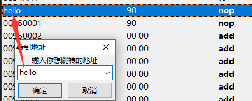
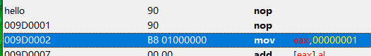
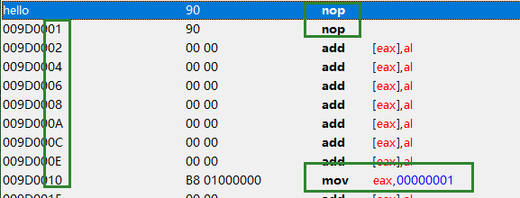
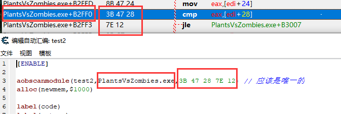
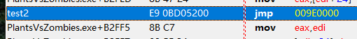
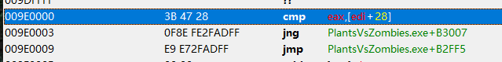
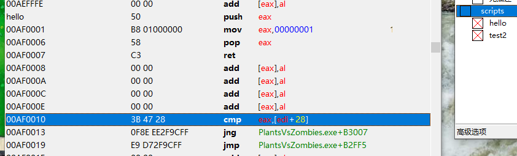
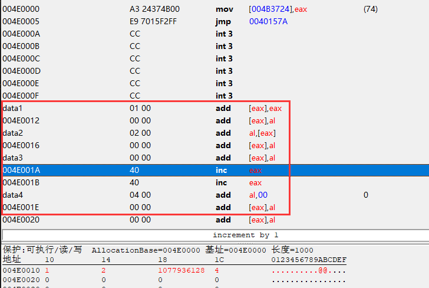

- [自动汇编器命令](https://wiki.cheatengine.org/index.php?title=Auto_Assembler:Commands)
- [自动汇编](https://wiki.cheatengine.org/index.php?title=Cheat_Engine:Auto_Assembler)
- AA脚本内默认使用16进制


## 基本注册
```
[ENABLE]
alloc(hello, $1000, PlantsVsZombies.exe)
registerSymbol(hello)

alloc(xxx, $8, PlantsVsZombies.exe)
registerSymbol(xxx)

xxx:
  nop

hello:
  push eax
  mov eax, 1
  pop eax
  ret

[DISABLE]
dealloc(hello)
unregisterSymbol(hello)
dealloc(xxx)
unregisterSymbol(xxx)
```

点击确定后，可以在内存中查看:



当禁用脚本后，内存和符号都将被释放

## 添加标签（label）
```
[ENABLE]
alloc(hello, $1000, PlantsVsZombies.exe)
registerSymbol(hello)

label(code) // 定义标签

hello:
  nop
  nop

// 创建，紧跟分配内存的下面
code:
  mov eax, 1

[DISABLE]
dealloc(hello)
unregisterSymbol(hello)
```



## 添加标签（define）

```
[ENABLE]
alloc(hello, $1000, PlantsVsZombies.exe)
registerSymbol(hello)

define(code, hello+10)

// 这里不用紧跟，因为定义好了地址
code:
  mov eax, 1

hello:
  nop
  nop

[DISABLE]
dealloc(hello)
unregisterSymbol(hello)
```



可以注册到指定模块地址：
```
define(code, PlantsVsZombies.exe+B2FF0)
```

## AOB注入/AOB扫描

```
aobScan：将扫描内存以查找给定的字节数组（支持通配符），并在第一个匹配项处放置标签
aobScanModule：将扫描特定模块的给定字节数组（支持通配符），并在第一个匹配项处放置标签
aobScanRegion：将扫描给定字节数组的特定范围（支持通配符），并在第一个匹配项处放置标签
```

大概就是，扫描到了指定位置，再将脚本放在这里



假如我在这一行注入了AOB脚本，那么执行后就是这样：





分配了一块新内存，然后跳了过去，执行完在跳回来

## 断言 [assert](https://wiki.cheatengine.org/index.php?title=Auto_Assembler:assert)

将检查给定字节的内存地址。如果地址的内存不是给定的字节数组所定义的，则自动汇编脚本将不会执行

```
[ENABLE]
assert(hello, 50 B8 01 00 00 00 58 c3) // 这里要是断言失败，就不会执行
aobscanmodule(test2,PlantsVsZombies.exe,3B 47 28 7E 12)
alloc(newmem,$1000)

label(code)
label(return)

...
```

```
define(address,"game.exe"+4BA45)
define(bytes,01 87 78 55 00 00)
assert(address,bytes)
```

## 在脚本中调用另一个脚本定义的符号

hello:
```
[ENABLE]
alloc(hello, $1000, PlantsVsZombies.exe)
registerSymbol(hello)


hello:
  push eax
  mov eax, 1
  pop eax
  ret

[DISABLE]
dealloc(hello)
unregisterSymbol(hello)
```

test2 调用了hello符号:
```
[ENABLE]
assert(hello, 50 B8 01 00 00 00 58 c3)
aobscanmodule(test2,PlantsVsZombies.exe,3B 47 28 7E 12) // 应该是唯一的
registersymbol(test2)

label(return)

hello+0x10:
  cmp eax,[edi+28]
  jle PlantsVsZombies.exe+B3007
  jmp return

test2:
  jmp hello+0x10

return:

[DISABLE]

test2:
  db 3B 47 28 7E 12

unregistersymbol(test2)
```



当两个脚本开启后，可以看到已经注入了


## [关于x64的人造指针](https://forum.cheatengine.org/viewtopic.php?p=5722856)

内存被分配的太远，导致指针太大

```
[ENABLE]
aobscanmodule(hpHf_INJECT,DarkSoulsIII.exe,89 83 D8 00 00 00 E9 E1)
alloc(newmem,$1000,"DarkSoulsIII.exe"+451065)

alloc(imyhp,$100,"DarkSoulsIII.exe"+451065)
registersymbol(imyhp)
imyhp:
 dq 0

label(return)
label(origencode)

newmem:
  pushf
  cmp [rbx+10],0
  jne origencode
  cmp [imyhp], 0
  jne origencode
  mov [imyhp],rbx // 设置指针
  jmp origencode

origencode:
  popf
  mov [rbx+D8],eax
  jmp return

hpHf_INJECT:
  jmp newmem
  nop
return:

registersymbol(hpHf_INJECT)

[DISABLE]
hpHf_INJECT:
  db 89 83 D8 00 00 00

unregistersymbol(imyhp)
dealloc(imyhp)
unregistersymbol(hpHf_INJECT)
dealloc(newmem)
```

线程调用:
```
[ENABLE]
alloc(hpregen,$1000)
registersymbol(hpregen)
createThread(hpregen)

label(mainloop)
label(end)
registersymbol(end)

hpregen:
  sub rsp,20
  jmp mainloop

mainloop:
  mov rcx,#500
  call Sleep
  
  // 要用寄存器转一下
  push rax
  mov rax,[imyhp]
  add [rax+d8], #100
  pop rax


  cmp [end],0
  je mainloop

  add rsp,20
  mov rcx,hpregen
  sub rdx,rdx
  mov r8d,8000
  jmp VirtualFree
  ret

end:
  dd 0

[DISABLE]
end:
  dd 1

unregistersymbol(end)
unregistersymbol(hpregen)
```

## [修改浮点值](https://www.cheatengine.org/forum/viewtopic.php?t=587424&sid=70e42364aea9461253caed444fc6dfb8)

```
  push rax
  mov rax,(float)100.0
  movd xmm1,rax
  pop rax
  movups [rcx+10],xmm1
```
```
  push rax
  mov rax,(double)100.0
  mov [esi+88],rax
  pop rax
```
```
// movss [rsi+28],xmm0
mov [rsi+28],(float)100
```

## [启用或禁用脚本](https://wiki.cheatengine.org/index.php?title=Lua:getAddressList)
```
-- 当前脚本id==438
local function _disableCurScript()
   getAddressList().getMemoryRecordByID(438).Active = false
end

setTimeout(_disableCurScript, 500)
```

## 标签简化 @@
- @@ 临时标签,不用label申请
- @f 下一个临时标签
- @b 上一个临时标签
- https://www.cheatengine.org/forum/viewtopic.php?t=572858&sid=9fd270b8ea956fc261d8f7e131ed9aad
- https://www.cheatengine.org/forum/viewtopic.php?t=578675&sid=f602e85947d4a22e54d543d7db4a7906

```
label(code)
label(return)

label(bMs) // 是否秒杀

newmem:
  pushfq
  cmp [rbx+18],0
  jne @f // [rbx+18] != 0 跳敌人
  mov eax,[rbx+134]
  jmp code

@@:// 敌人
  cmp [bMs],0
  jne @f // 跳到开启秒杀
  jmp code

@@://开启秒杀
  // 避免自动秒
  cmp [rbx+134],eax
  je code
  mov eax,0
  jmp code


code:
  popfq
  mov [rbx+00000130],eax
  jmp return

bMs:
  db 0
```

## 数据对齐
```
[ENABLE]
aobscanmodule(INJECT,game2.exe,A3 24 37 4B 00)
alloc(newmem,$1000)

label(return)

label(data1)
label(data2)
label(data3)
label(data4)

newmem:
  mov [004B3724],eax
  jmp return

// 将数据放在分配代码的末尾
align 10 CC

// 数据最大为4字节
// 4*4==16一共用了16个字节
data1:
  dd 1
data2:
  db 2   // db只有一个字节，在下面使用align 4对齐4字节 02 00 00 00
  align 4
data3:
  dd (float)3.0
data4:
  dd 4

INJECT:
  jmp newmem
return:
registersymbol(INJECT data1 data2 data3 data4)

[DISABLE]
INJECT:
  db A3 24 37 4B 00
unregistersymbol(INJECT data1 data2 data3 data4)
dealloc(newmem)
```



## 定于简单的结构体数据
```
[ENABLE]
aobscanmodule(INJECT,game2.exe,A3 24 37 4B 00)
alloc(newmem,$1000)
label(code)
label(return)
label(mystruct)

struct player
hp: dd 0
maxhp: dd 0
other: db 0
endstruct

newmem:
  mov eax,0
  add eax,[mystruct]
  add eax,[mystruct+4]
  add eax,[mystruct+8]
  
  // 使用结构体偏移
  mov eax,0
  add eax,[mystruct+player.hp]
  add eax,[mystruct+player.maxhp]
  add eax,[mystruct+player.other]

code:
  mov [004B3724],eax
  jmp return

align 10 cc
mystruct:
  dd 1
  dd 2
  db 1
  align 4
  dd (float)10
  dd (float)20

INJECT:
  jmp newmem
return:
registersymbol(INJECT mystruct)

[DISABLE]
INJECT:
  db A3 24 37 4B 00
unregistersymbol(INJECT mystruct)
dealloc(newmem)
```

## 字符串判断
```
  cmp [rax+40],'Player'
  jne @f // enemy
  // player
  mov [pHp],rax
  jmp code

@@: // enemy
  ...
```


## 使用基址判断差异
```
define(address,"witcher3.exe"+E3BF93)
define(bytes,F3 0F 11 34 88)

[ENABLE]
assert(address,bytes)
alloc(newmem,$1000,"witcher3.exe"+E3BF93)

label(code return player enemy)
label(pHp)

// [[[[[["witcher3.exe"+02AA4148]+28]+10]+1C0]+110]+30]+0
[[[[["witcher3.exe"+02AA4148]+28]+10]+1C0]+110]+30:
pHp:

newmem:
  pushfq
  push rdx

  mov rdx,pHp // 将指针保存在寄存器中
  cmp rax,[rdx] // 如果指针和玩家基址是否一样
  je player

enemy:
  xorps xmm6,xmm6
  jmp code

player:
  lea rdx,[rax+rcx*4]
  movss xmm6,[rdx+04] // set max hp

code:
  pop rdx
  popfq
  movss [rax+rcx*4],xmm6
  jmp return

address:
  jmp newmem
return:

[DISABLE]
address:
  db bytes

dealloc(newmem)
```