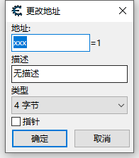
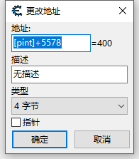

这里全用[AOB](https://wiki.cheatengine.org/index.php?title=Tutorials:AOBs)注入例子

## 基本注入

```
[ENABLE]
aobscanmodule(a_INJECT,PlantsVsZombies.exe,04 01 87 78 55 00 00)// 在哪里注入
alloc(newmem,$1000)// 分配给注入脚本的内存

label(code)
label(return)

newmem:

code:
  // add [edi+00005578],eax
  add [edi+00005578], 0x1
  jmp return

a_INJECT+01:
  jmp newmem
  nop
return:
registersymbol(a_INJECT) //创建符号

[DISABLE]

a_INJECT+01:
  db 01 87 78 55 00 00

unregistersymbol(a_INJECT)
dealloc(newmem)
```

将默认的添加改为了固定的1，启动脚本，在反汇编窗口ctrl+u可以看到现在只有一个自定义符号a_INJECT，禁用脚本全部将复原

## 创建可编辑的值

```
[ENABLE]
aobscanmodule(a_INJECT,PlantsVsZombies.exe,04 01 87 78 55 00 00)
alloc(newmem,$1000)

// 申请内存，xxx=内存地址编号
globalalloc(xxx,4)
xxx:
 dd (int)1

label(code)
label(return)

newmem:

code:
  // add [edi+00005578],eax
  push eax
  mov eax, [xxx]
  add [edi+00005578],eax
  pop eax
  jmp return
a_INJECT+01:
  jmp newmem
  nop
return:
registersymbol(a_INJECT)
[DISABLE]

a_INJECT+01:
  db 01 87 78 55 00 00
unregistersymbol(xxx)
unregistersymbol(a_INJECT)
dealloc(newmem)
dealloc(xxx)
```

添加到地址，可以手动修改值



## 获取指针

```
[ENABLE]
aobscanmodule(a_INJECT,PlantsVsZombies.exe,04 01 87 78 55 00 00)
alloc(newmem,$1000)

globalalloc(xxx,4)
xxx:
 dd (int)1

globalalloc(pint,4)
pint:
 dd 0

label(code)
label(return)

newmem:

code:
  // add [edi+00005578],eax
  push eax
  mov eax, [xxx]
  add [edi+00005578],eax
  mov [pint],edi
  pop eax
  jmp return
a_INJECT+01:
  jmp newmem
  nop
return:
registersymbol(a_INJECT)
[DISABLE]

a_INJECT+01:
  db 01 87 78 55 00 00
unregistersymbol(xxx)
unregistersymbol(pint)
unregistersymbol(a_INJECT)
dealloc(newmem)
dealloc(pint)
dealloc(xxx)
```




## AA脚本混合Lua
```

[ENABLE]

aobscanmodule(INJECT,PlantsVsZombies.exe,04 01 87 78 55 00 00)
alloc(newmem,$1000)

alloc(xxx,8)
registersymbol(xxx)
xxx:
 dd 0

label(code)
label(return)

newmem:
  mov [xxx],edi
code:
  add [edi+00005578],eax
  jmp return

INJECT+01:
  jmp newmem
  nop
return:
registersymbol(INJECT)

{$lua}
if syntaxcheck then return end

id = setInterval(function()
 -- 必须先检查自定义的符号是否存在
 local v = readInteger("[xxx]+5578")
 if v == nil then return end

 writeInteger("[xxx]+5578", v+10)
end, 100)
{$asm}

[DISABLE]
INJECT+01:
  db 01 87 78 55 00 00

{$lua}
if syntaxcheck then return end
clearInterval(id)
{$asm}

unregistersymbol(xxx)
dealloc(xxx)
unregistersymbol(INJECT)
dealloc(newmem)
```