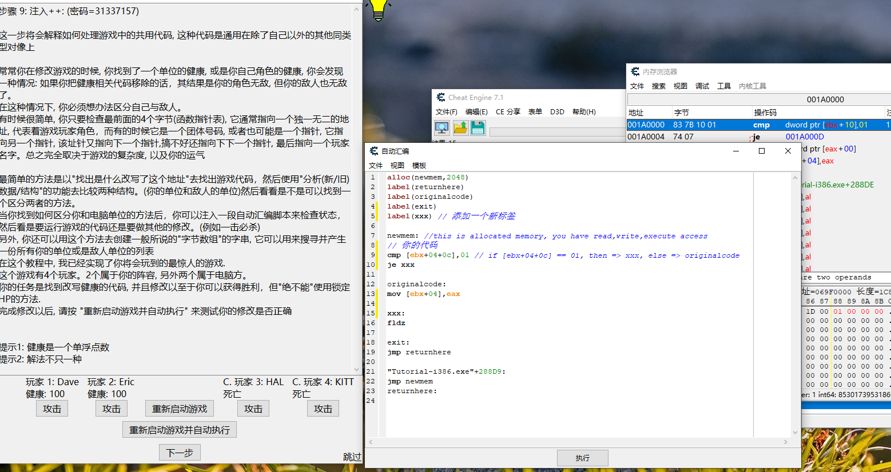
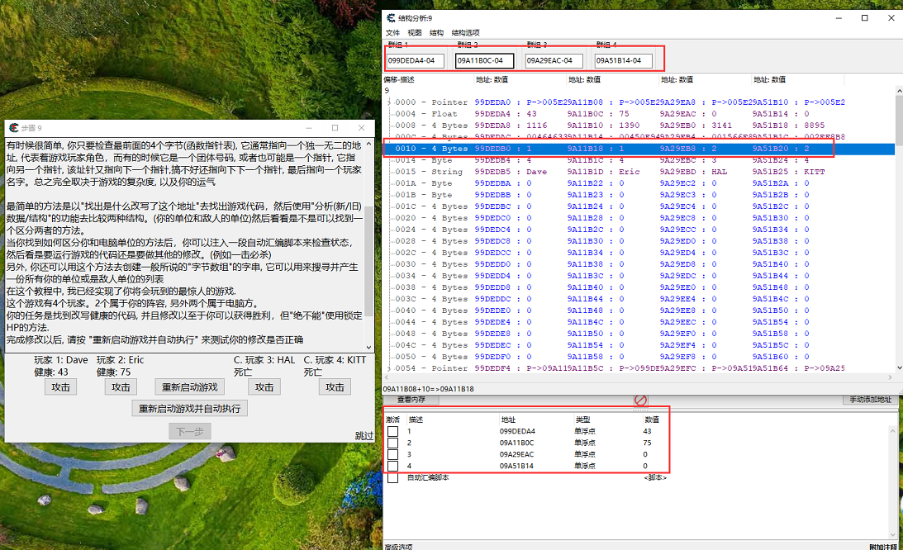

- [解答地址](https://ganlvtech.github.io/2018/01/25/cheat-engine-tutorial/#step-9-shared-code-pw-31337157)



通过辨别队伍的编号解决问题

```
alloc(newmem,2048)
label(returnhere)
label(originalcode)
label(exit)
label(xxx) // 添加一个新标签

newmem: //this is allocated memory, you have read,write,execute access
// 你的代码
cmp [ebx+04+0c],01 // if [ebx+04+0c] == 01, then => xxx, else => originalcode
je xxx

originalcode:
mov [ebx+04],eax

xxx:
fldz 

exit:
jmp returnhere

"Tutorial-i386.exe"+288D9:
jmp newmem
returnhere:
```

还有种方法，这种方法更使用与大多数游戏，[参考视频](https://www.youtube.com/watch?v=kpSRUJfaT1o&list=PLNffuWEygffbbT9Vz-Y1NXQxv2m6mrmHr&index=21)



通过分析结构找到不同的点，然后在进行区分

```
[ENABLE]

aobscanmodule(INJECT,Tutorial-i386.exe,89 43 04 D9 EE) // should be unique
alloc(newmem,$1000)

label(code)
label(return)
label(xxx)

newmem:
  cmp [ebx+10],1 // 如果等于1，说明不是敌人直接跳过，否则就执行秒杀
  je xxx

code:
  // mov [ebx+04],eax
  mov [ebx+04],0
  fldz 
  jmp return

xxx:
  fldz
  jmp return

INJECT:
  jmp newmem
return:
registersymbol(INJECT)

[DISABLE]
INJECT:
  db 89 43 04 D9 EE

unregistersymbol(INJECT)
dealloc(newmem)
```

关于一条指令可能会影响很多值的情况，通过找差异来判断当前处理的为那个值，这些差异可能存在内存偏移中，寄存器中，堆栈中，XMM0-XMM15，[建议观看此视频](https://www.youtube.com/watch?v=5fJFSOPGZyQ&list=PLNffuWEygffbbT9Vz-Y1NXQxv2m6mrmHr&index=44&t=0s)