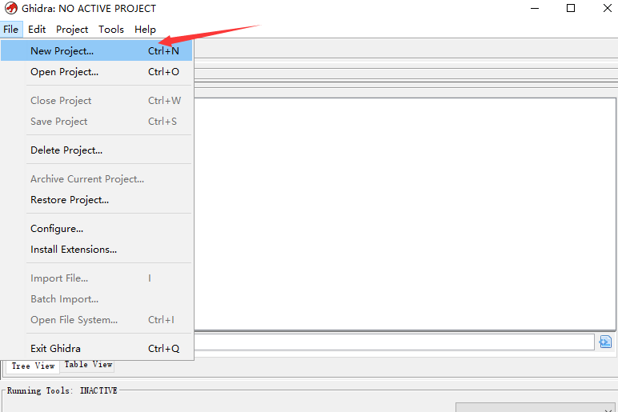
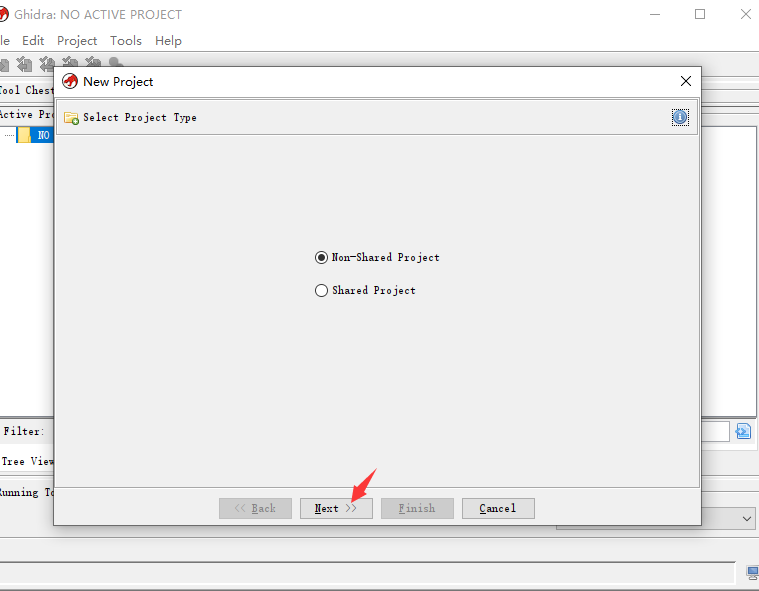
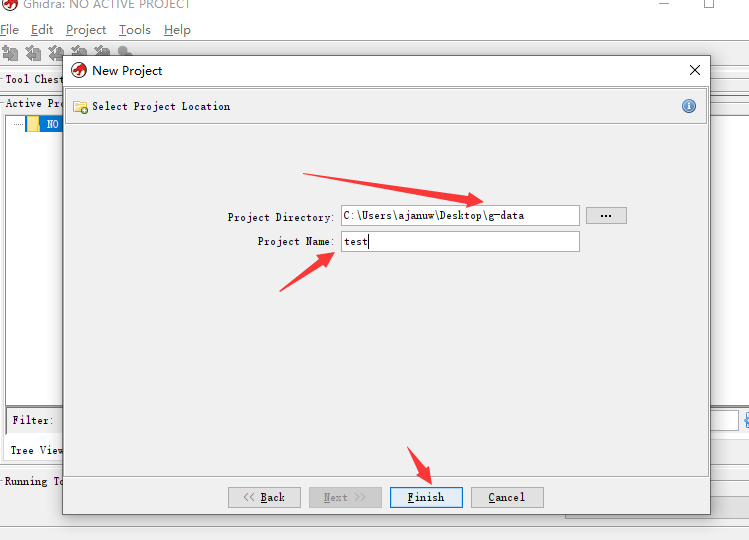
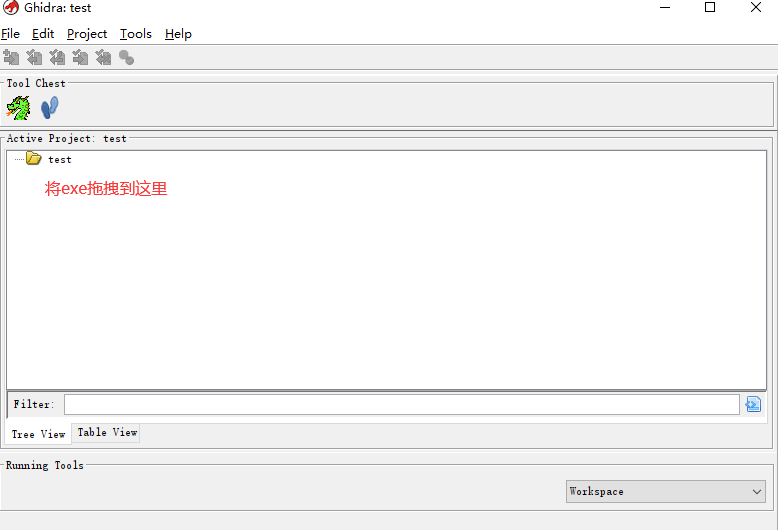
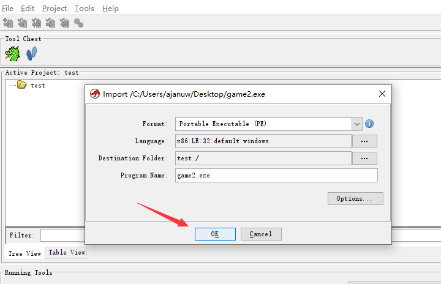
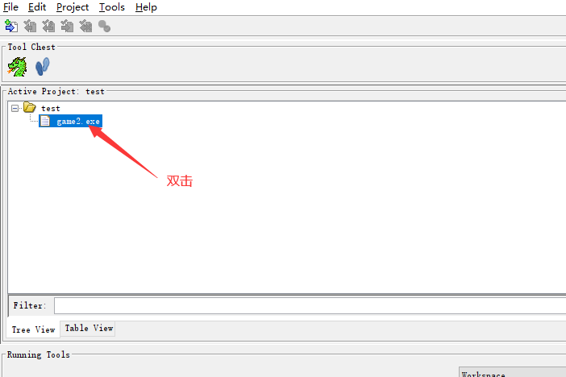
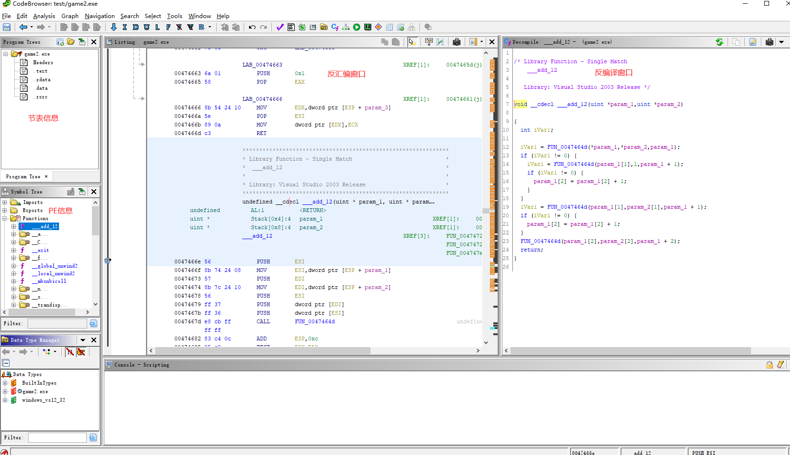
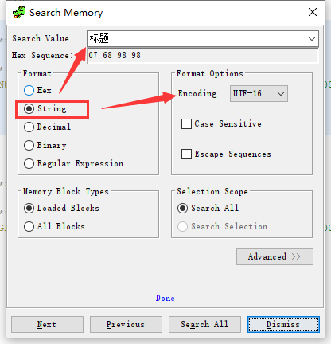
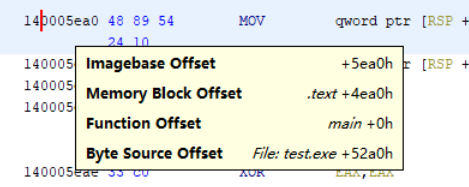

- [官网下载](https://ghidra-sre.org/)
- [github](https://github.com/NationalSecurityAgency/ghidra)
- [Ghidra 备忘表](https://ghidra-sre.org/CheatSheet.html)

## 新建项目

## 搜索字符串

顶部工具栏 > Search > Memory

快捷键 `s`

先择 String 和 Encode

## 地址偏移

imagebase offset 是程序运行时,  address = 模块基址 + 5ea0

Byte Source offset 是本地文件中的偏移