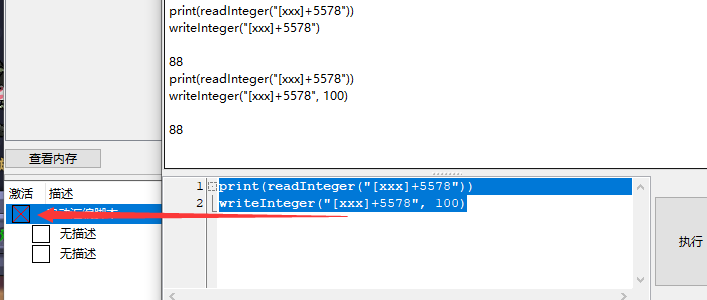
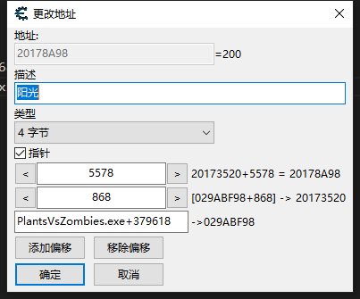

## Lua引擎

[视频教程](https://www.youtube.com/watch?v=hnZyZio5FBQ&list=PLNffuWEygffbbT9Vz-Y1NXQxv2m6mrmHr&index=69)

[ce lua api](https://wiki.cheatengine.org/index.php?title=Lua)

通用修改器，文件->从表单中生成通用修改器，会打开一个ui编辑器，可也打包为exe可执行文件，和运行lua脚本

内存浏览器 -> 工具-> Lua引擎, 快捷键 ctrl+l 可以打开一个lua的调试器 

这里使用了`xxx`符号，所以脚本需要打开，不然会失败：



## 添加断点
```
debugProcess()

myaddress = getAddress("game.exe+4BA45")
debug_setBreakpoint(myaddress);
```

在断下后，可以获取数据:
```
debugProcess()
myaddress = getAddress("PlantsVsZombies.exe+4BA45")

myvar=EAX
print(myvar)
print(EAX)
print(EDI)
debug_removeBreakpoint(myaddress);
```

## 读写指针


```
print(readInteger('[["PlantsVsZombies.exe"+0x379618]+0x868]+0x5578'))
writeInteger('[["PlantsVsZombies.exe"+0x379618]+0x868]+0x5578', 200)
```

## [将AA脚本转化为Lua](https://www.youtube.com/watch?v=eEg3q2qocwQ&list=PLNffuWEygffbbT9Vz-Y1NXQxv2m6mrmHr&index=71)


AA脚本:
```
define(address,"PlantsVsZombies.exe"+B2FF0)
define(bytes,3B 47 28 7E 12)

[ENABLE]
Assert(address,bytes)
Alloc(newmem,$1000)

label(return)

newmem:
  cmp eax,[edi+28]
  nop
  nop
  jmp return

address:
  jmp newmem
return:

[DISABLE]
address:
  db bytes

deAlloc(newmem)
```


Lua AA Script:
```
{$lua}

[ENABLE]
bytes = {0x3B , 0x47 , 0x28 , 0x7E , 0x12}

-- 要创建符号autoAssemble里面才能访问
address = '"PlantsVsZombies.exe"+B2FF0'
registerSymbol("address", address)

mem = allocateMemory(0x1000)
registerSymbol("newmem", mem)

autoAssemble([[
  label(return)

  newmem:
    cmp eax,[edi+28]
    nop
    nop
    jmp return

  address:
    jmp newmem
  return:
]])

[DISABLE]
writeBytes(address, bytes)

unregisterSymbol("newmem")
unregisterSymbol("address")
deAlloc(mem, 0x1000)

address = nil
mem = nil
bytes = nil
```

在Lua引擎中:
```
function initYg()
  bytes = {0x3B , 0x47 , 0x28 , 0x7E , 0x12}

  -- 要创建符号autoAssemble里面才能访问
  address = '"PlantsVsZombies.exe"+B2FF0'
  registerSymbol("address", address)

  mem = allocateMemory(0x1000)
  registerSymbol("newmem", mem)

  autoAssemble([[
    label(return)

    newmem:
      cmp eax,[edi+28]
      nop
      nop
      jmp return

    address:
      jmp newmem
    return:
  ]])
end

function disposeYg()
  writeBytes(address, bytes)

  unregisterSymbol("newmem")
  unregisterSymbol("address")
  deAlloc(mem, 0x1000)

  address = nil
  mem = nil
  bytes = nil
end
```

## [使用`setTimeout`和`setInterval`更简单的计时器](https://github.com/januwA/CEScript-timer)

## 自动附加到进程

每隔1s去找'game2.exe'是否运行，找到后附加进程并且结束计时器

```
local PROCESS_NAME = 'game2.exe'

id = setInterval(function()
  print('find...')
  if getProcessIDFromProcessName(PROCESS_NAME) ~= nil then
     print('finded.')
    clearInterval(id)
    openProcess(PROCESS_NAME)
  end
end, 1000)
```

## [使用ini配置](https://santoslove.github.io/inifile.html)

将`inifile.lua`文件放在autorun文件夹中，并且将inifile改为全局对象

```
{$lua}
if syntaxcheck then return end

[ENABLE]

--[[iniTable = {}

iniTable['1'] = {x = 10, y = 100, z = 22}
iniTable['2'] = {x = 20, y = 200, z = 33}
iniTable['3'] = {x = 30, y = 300, z = 44}

inifile.save('example.ini', iniTable)
--]]

 iniTable = inifile.parse('example.ini')
 showMessage(iniTable['1']['x'])
 
[DISABLE]
```

或者将`inifile.lua`放在脚本同目录，然后导入使用
```
{$lua}
if syntaxcheck then return end

local INI = require "inifile"

[ENABLE]
 iniTable = INI.parse('example.ini')
 showMessage(iniTable['1']['x'])
 
[DISABLE]
```

## 导入lua文件

 ```
 -- 只会在第一次导入
require("mmm")

-- 每次使用都会导入
dofile("mmm.lua")
 ```

 如果你要调试就用`dofile`否则就用`require`，lua脚本需要和CT文件放在同一级目录

 - https://wiki.cheatengine.org/index.php?title=Tutorials:Lua:Basics#Script_windows


## 转换工具函数
```
local bt = floatToByteTable(1000.0)

 for k, v in pairs(bt) do
   print(string.format('%02X', v))
 end

 print( byteTableToFloat({0x00, 0x00, 0x7a, 0x44}) )

print('-----')
bt =  dwordToByteTable(10)
 for k, v in pairs(bt) do
   print(string.format('%02X', v))
 end
 print(	byteTableToDword({0x0a,0x00,0x00,0x00}) )
```
```
00 
00 
7A 
44 
1000.0 
----- 
0A 
00 
00 
00 
10 
```


## [在远程进程中执行MessageBoxA x64](https://forum.cheatengine.org/viewtopic.php?t=604716&sid=69f971193a403f527ea8d96f48007867)

```
if messageBoxACaller==nil then
  if autoAssemble([[
    alloc(messageBoxACaller,128)
    registersymbol(messageBoxACaller)
messageBoxACaller:
    sub rsp,0x28
    mov r9,[rcx+18] //button
    mov r8,[rcx+10] //caption
    mov rdx,[rcx+8] //text
    mov rcx,[rcx] //hwnd
    call MessageBoxA

    add rsp,0x28
    ret

  ]]) then
    messageBoxACaller=getAddressSafe('messageBoxACaller')
  end
end

if messageBoxACaller==nil then
  error('autoAssemble failed')
end

function MessageBox(hwnd, message, caption, button)
  -- 申请一块内存,返回地址
  local mymem=allocateMemory(512)

  -- 从申请得到的地址开始写入数据
  local captionaddress
  writeString(mymem, message)
  writeBytes(mymem+#message,0) --0 terminator
  captionaddress=mymem+#message+1

  -- 偏移地址后，继续写入数据
  writeString(captionaddress,caption)
  writeBytes(captionaddress+#caption,0)

  -- 偏移地址后，继续写入数据
  local params=captionaddress+#caption+1
  writeQword(params,hwnd) --hwnd
  writeQword(params+8,mymem) --text
  writeQword(params+16,captionaddress) --caption
  writeQword(params+24,button) --button (0=ok)

  -- 执行函数传入params地址，并等待返回
  local r = executeCode(messageBoxACaller,params)

  deAlloc(mymem)
  return r
end

print( MessageBox(0, 'BLA','XXX',2) )
```

## 设置游戏速度
1为正常,大于1加速，小于1减速
```
speedhack_setSpeed(1.5)
speedhack_getSpeed()
```


## AOBScan 找到过于复杂的字节集
```
local res = AOBScan("A3 24 37 4B 00")

if res == nil then return end

-- 可能返回多个相同字节集的地方
for i=0, res.Count-1, 1 do
  -- print( type(res[i]) ) string
  -- print(  res[i] + 3 ) 移动3字节

  -- 判断其中一个字节,找到自己想要的位置
  if  readBytes( '0x'..(res[i]+3) ) ~= 0 then

    -- 注册helloSymbol符号
    registerSymbol('helloSymbol', res[i])
  end
end
res.destroy()
```


## 重写多个相同的字节集

将找到的所有字节集全部指向设置的函数

创建函数newmemTest:
```
[ENABLE]
// 申请100字节大小的内存来存放函数
alloc(newmemTest,$100)
registersymbol(newmemTest)

newmemTest:
  mov [ecx+70],(float)0
  ret

[DISABLE]
unregistersymbol(newmemTest)
dealloc(newmemTest)
```

扫描所有字节集，全部重写：
```
{$lua}

if syntaxcheck then return end

[ENABLE]
-- 获取秒杀函数地址
local funAddres = getAddressSafe('newmemTest')
if funAddres == nil then return end


-- 获取所有
aobs = AOBScan("F3 0F 11 49 70")
if aobs == nil then return end


for i=0, aobs.Count-1, 1 do
  -- 获取新的字节集
  -- https://github.com/januwA/ce-plugins/blob/master/getJmpNewBytes.lua
  local newJmpBytes = getJmpNewBytes('0x'..aobs[i], funAddres, 5, { 0xE8 })
  -- 写入新的字节集
  writeBytes('0x'..aobs[i], newJmpBytes)
end
 
 
[DISABLE]
-- 恢复所有字节集
for i=0, aobs.Count-1, 1 do
  writeBytes('0x'..aobs[i], {0xF3, 0x0F, 0x11, 0x49, 0x70})
end
aobs.destroy()
aobs = nil
```

## 获取当前脚本MemoryRecord上下文
```
 -- getAddressList().getMemoryRecordByDescription('des').Active = false
 memrec.Active = false
```

## AA脚本调用LUA函数
- https://forum.cheatengine.org/viewtopic.php?t=605733

x86
```
{$lua}
function myfunction(p1, p2, p3)
  print(p1, p2, p3)
  -- mov eax,#100
  return 100
end
{$asm}

// =================================== 加载dll
loadlibrary(luaclient-i386.dll)
luacall(openLuaServer('CELUASERVER'))
CELUA_ServerName:
  db 'CELUASERVER',0
// ===================================


define(address,"game2.exe"+1575)
define(bytes,A3 24 37 4B 00)

[ENABLE]

assert(address,bytes)
alloc(newmem,$1000)

label(code)
label(return)

// ==================== 函数id和函数名
alloc(functionid,4)
alloc(functionname,16)
functionid:
dd 0
functionname:
db 'myfunction',0
// ====================


newmem:
  push eax
  push edx
  push ecx

  mov ecx,[functionid]
  test ecx,ecx
  jne call_my_fun // 有functionid 跳

  // functionid = CELUA_GetFunctionReferenceFromName(functionname)
  push eax
  push functionname
  call CELUA_GetFunctionReferenceFromName
  mov [functionid],eax
  mov ecx,eax
  pop eax

call_my_fun:
  push ebp
  mov ebp,esp

  // 参数顺序 从左向右
  sub esp,0C //allocate space ofr 1 parameter
  mov [ebp-04],3   // p3
  mov [ebp-08],2   // p2
  mov [ebp-0c],eax // p1

  // CELUA_ExecuteFunctionByReference(函数id, 函数需要多少参数, 函数参数地址, 同步还是异步)
  push 0 //0 同步跟新gui, 1 异步不会跟新gui
  lea edx,[ebp-0C]
  push edx //address of the parameter list
  push 3 //number of parameters (1)
  push ecx //functionid reference

  call CELUA_ExecuteFunctionByReference

  mov esp,ebp
  pop ebp

  pop ecx
  pop edx
  pop eax

code:
  mov [game2.exe+B3724],eax
  jmp return

address:
  jmp newmem
return:

[DISABLE]
address:
  db bytes

dealloc(newmem)
```

x64
```
{$lua}
function myfunction(p1, p2, p3)
  print(p1, p2, p3)
  -- mov eax,0
  return 0
end
{$asm}

//======================================
loadlibrary(luaclient-x86_64.dll)
luacall(openLuaServer('CELUASERVER'))
CELUA_ServerName:
  db 'CELUASERVER',0

alloc(functionid,4)
alloc(functionname,16)
functionid:
  dd 0
functionname:
  db 'myfunction',0
//======================================


define(address,"Tutorial-x86_64.exe"+2B08C)
define(bytes,29 83 F0 07 00 00)

[ENABLE]
assert(address,bytes)
alloc(newmem,$1000,"Tutorial-x86_64.exe"+2B08C)

label(code)
label(return)

newmem:
  // 保存旧寄存器、函数调用和paramlist分配空间（并保持16字节对齐）
  // 旧寄存器 7*8=56
  // 函数调用 4*8=32
  // paramlist 3*8=24
  // 56+32+24=112=0x70
  sub rsp,70
  mov [rsp+20],rcx // 这里偏移20，将前面的位置留给函数内部
  mov [rsp+28],rdx
  mov [rsp+30],r8
  mov [rsp+38],r9
  mov [rsp+40],r10
  mov [rsp+48],r11
  mov [rsp+50],rax
  //[rsp+58]=paramlist

  mov ecx,[functionid]
  test ecx,ecx
  jne hasrefid

  // functionid = CELUA_GetFunctionReferenceFromName(functionname)
  mov rcx,functionname
  call CELUA_GetFunctionReferenceFromName
  mov [functionid],eax
  mov ecx,eax

hasrefid:

  // CELUA_ExecuteFunctionByReference(rcx 函数id, rdx 函数需要多少参数, r8 函数参数地址, r9 同步还是异步)
  mov rdx,3

  lea r8,[rsp+58] // paramlist

  mov rax,[rsp+50]
  mov [r8],rax            // p1

  mov rax,2
  mov [r8+8],rax  // p2

  mov rax,3
  mov [r8+10],rax  // p3

  mov r9,0
  call CELUA_ExecuteFunctionByReference

  mov rcx,[rsp+20]
  mov rdx,[rsp+28]
  mov r8,[rsp+30]
  mov r9,[rsp+38]
  mov r10,[rsp+40]
  mov r11,[rsp+48]
  //mov rax,[rsp+50]
  add rsp,70
code:
  sub [rbx+000007F0],eax
  jmp return

address:
  jmp newmem
  nop
return:

[DISABLE]
address:
  db bytes

dealloc(newmem)
```

## XBOX 按键
- https://wiki.cheatengine.org/index.php?title=Lua:getXBox360ControllerState

```
xboxState = getXBox360ControllerState()
require 'pl.pretty'.dump(xboxState)
```
```
{
  ControllerID = 0,
  PacketNumber = 4587,

  GAMEPAD_A = false,
  GAMEPAD_B = false,
  GAMEPAD_X = false,
  GAMEPAD_Y = false,

  GAMEPAD_BACK = false,
  GAMEPAD_START = false,
  
  // 十字键
  GAMEPAD_DPAD_DOWN = false,
  GAMEPAD_DPAD_LEFT = false,
  GAMEPAD_DPAD_RIGHT = false,
  GAMEPAD_DPAD_UP = false,
  
  // LB和RB
  GAMEPAD_LEFT_SHOULDER = false,
  GAMEPAD_RIGHT_SHOULDER = false,
  
  // LT和RT
  LeftTrigger = 0,
  RightTrigger = 97,
  
  //左摇杆按下和右摇杆按下
  GAMEPAD_LEFT_THUMB = false,
  GAMEPAD_RIGHT_THUMB = false,
  
  // 左摇杆 -32768至32767
  ThumbLeftX = 328,
  ThumbLeftY = -1536,
  
  // 右摇杆 -32768至32767
  ThumbRightX = 649,
  ThumbRightY = -3097,

  // 不知道是什么
  wButtons = 0
} 
```

## 获取打开的进程ID
```
pid = getOpenedProcessID()
```

## 获取目标进程的窗口句柄
```
w=getWindow(getForegroundWindow(), GW_HWNDFIRST)

pid=getOpenedProcessID()

while w and (w~=0) do
  if getWindowProcessID(w)==pid then
    print(w..' - '..getWindowCaption(w)..'('..getWindowClassName(w)..')')
  end
  w=getWindow(w,GW_HWNDNEXT)
end
```

## 获取窗口的RECT
- https://www.cheatengine.org/forum/viewtopic.php?t=613162&postdays=0&postorder=asc&start=0&sid=5ae16ed6a3b6d91917d56252b0d82046
- https://docs.microsoft.com/en-us/windows/win32/api/winuser/nf-winuser-getwindowrect
- https://docs.microsoft.com/en-us/windows/win32/api/windef/ns-windef-rect
- https://wiki.cheatengine.org/index.php?title=Lua:createMemoryStream
- 使用getTargetWindowRect https://github.com/januwA/ce-plugins

```
dump( getTargetWindowRect() )
```

## 在LUA中调用win32 API
```
if executeCodeLocalEx("MessageBoxA", 0, "a", "title", 0) then
  print("ok")
end
```