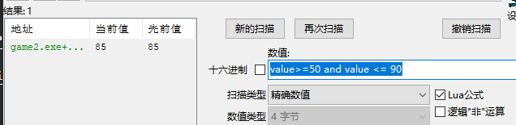

# 记录游戏逆向学习

- [汇编基础推荐视频](https://ke.qq.com/course/320677?taid=2384630267569317)
- [学习CE软件推荐视频](https://www.youtube.com/playlist?list=PLNffuWEygffbbT9Vz-Y1NXQxv2m6mrmHr)
- 最好走一篇ce自带的基础教程

未/改变的值: 假如0=>1=>0这个过程，会在1阶段视为改变，但是回到0后被视为未改变

## Lua公式

可以在数值区域输入Lua的条件表达式

> value~=100 or value==100 or value == 200 and previousvalue~=10

