## 解析结构

c++ 测试代码
```cpp
#include <iostream>
using namespace std;

struct MyStruct
{
  int a = 1;
  const char* cs = "str";
  const wchar_t* wcs = L"str2";
} s;

int main()
{
  printf("pointer: %lp\n", &s);
  cin.get();
  return 0;
}
```

reclass 附加进程 `file -> attrch`

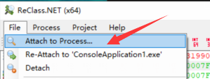

创建一个class


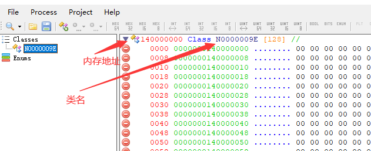

双击地址设置为c++程序打印的地址，双击类名改为struct

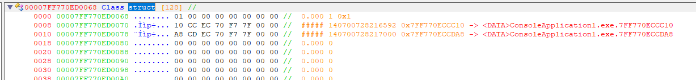

解析类，我们知道a是int

右键第一行选择`change type -> int32`

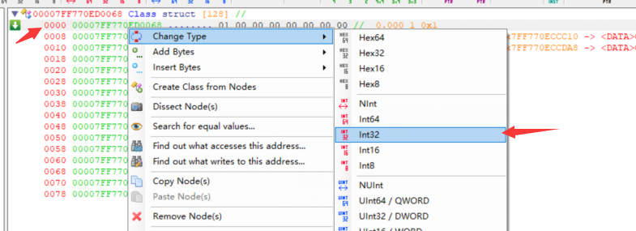

设置类型后

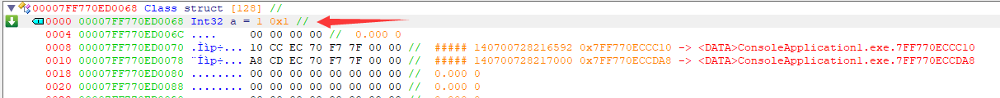

下面有4字节对齐的pading，将类型设置为text，大小4字节

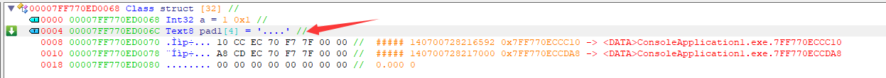


剩下两个我们知道是`char*`和`wchar_t*`，定义类型后

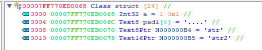

多余的字节可以使用`delete`删除掉，字节不够可以右键`add bytes`


如果你想在c++中使用解析的class `右键 类名 -> show c++ code`

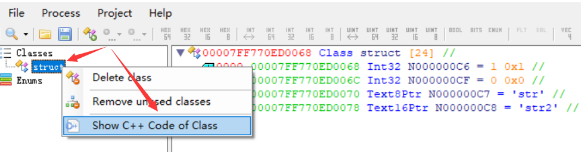

复制到你的c++程序使用

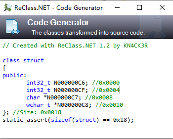

## data**

c++
```cpp
#include <iostream>
using namespace std;

class MyStruct
{
  int a = 1;
  const char* cs = "str";
  const wchar_t* wcs = L"str2";
};

int main()
{
  auto* pX = new MyStruct();
  auto** ppX = &pX;
  printf("pointer: %lp\n", ppX);
  cin.get();
  return 0;
}
```

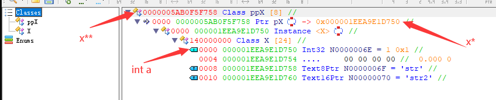

使用CE解析结构

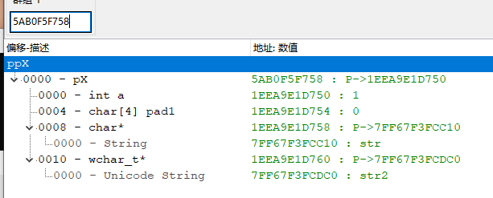

## 数组 1 `B* arr[3]`

c++
```cpp
#include <iostream>
using namespace std;

class B { public: size_t i; };
class A { public: B* arr[3]; int a; };

int main()
{
  auto* pA = new A;
  pA->a = 100;

  for (size_t i = 0; i < 3; i++)
  {
    pA->arr[i] = new B{ i };
  }

  printf("pointer: %lp\n", pA);
  cin.get();
  return 0;
}
```

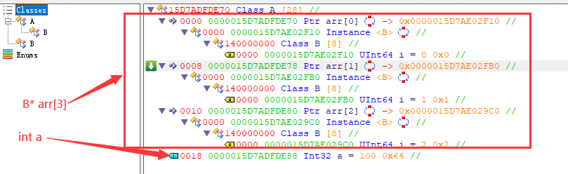

## 数组 2 `B** arr`

c++
```cpp
#include <iostream>
using namespace std;

class B { public: size_t i; };
class A { public: B** arr; int a; };

int main()
{
  auto* pA = new A;
  pA->a = 100;

  B* arr[3];
  for (size_t i = 0; i < 3; i++)
    arr[i] = new B{ i };
  pA->arr = arr;

  printf("pointer: %lp\n", pA);
  cin.get();
  return 0;
}
```

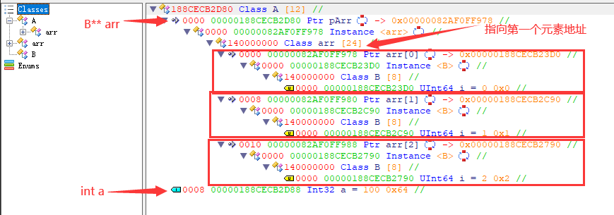

## 数组 3 `B** arr[3]`
```cpp
#include <iostream>
using namespace std;

class B { public: size_t i; };
class A { public: B** arr[3]; int a; };

int main()
{
  auto* pA = new A;
  pA->a = 100;

  B* pB;
  B** ppB;
  for (size_t i = 0; i < 3; i++)
  {
    pB =  new B{ i };
    ppB = (B**)malloc(sizeof(uintptr_t));
    memcpy_s(ppB, 8, &pB, 8);
    pA->arr[i] = ppB;
  }

  printf("pointer: %lp\n", pA);
  cin.get();
  return 0;
}
``` 

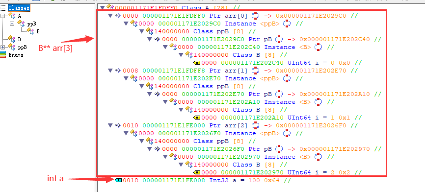