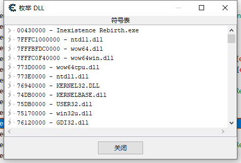

1. 在ce主页面的 查看内存按钮，可以进入
2. f5 添加断点,再按取消断点
3. 然后点击上面的步过，可以跟踪代码的流向
4. 跟踪过程中按`BkSp`可以回退

## 删除指令

在当前指令上，右键，使用空指令替换，那么指令占用的地址，将被nop填充

## 修改指令

最好使用注入的方式，[参考文档](https://wiki.cheatengine.org/index.php?title=Template:TutorialsAA)

1. 在要修改的指令上，`ctrl+a`打开自动会变
2. 可以选择注入模板，也可以手写
3. 写好后点击左上角文件，分派到当前ct表

## 书签

右键在当前指令这里设置书签，在跟踪代码期间，可以在书签中跳转

## 添加到代码表
右键将指令添加到代码表，可以在ce的主页页面的左下角的 高级选项 中看到，在下次进入ce，可以直接打开，定位到这段反汇编中

注：在ce中，记得保存文件的习惯

## 用户自定义符号

快捷键：`ctrl+u`，用于调试很方便

## [找出指令访问的地址](https://www.youtube.com/watch?v=5fJFSOPGZyQ&list=PLNffuWEygffbbT9Vz-Y1NXQxv2m6mrmHr&index=44&t=0s)

假如你找到了使你的hp减少的指令，但是有可能你的mp，耐力，敌人的hp之类的都在调用这个指令。

在这个指令上，右键->找出指令访问的地址，然后在游戏中做一些事，你会发现视图中出现了不同的地址

## [枚举DLL和符号表](https://www.youtube.com/watch?v=U8_3lCp1nas&list=PLNffuWEygffbbT9Vz-Y1NXQxv2m6mrmHr&index=54&t=0s)

反汇编窗口，视图->枚举DLL和符号表，慢慢找吧，可能有你想要的

## [反外挂检测代码完整](https://www.youtube.com/watch?v=42cIzOZPogQ&list=PLszEh0IDMrCmPK-0wpe-cyu08Kj7MGYyo&index=30&t=0s)

## 工具 -> 注入DLL

附加进程，然后在注入DLL，选择自己编写的DLL，点击确定

## [一条指令有几十或几百个地方都在调用，如何区分(指令回溯)](https://www.youtube.com/watch?v=fEaf9DnqO2c&list=PLszEh0IDMrCmPK-0wpe-cyu08Kj7MGYyo&index=145&t=0s)

1. 使用CE热键暂停游戏
2. 在指令上设置中断并跟踪断点
3. 在断点列表找到这个断点，并给这个断点设置更改条件
3. 断点触发，往上找call