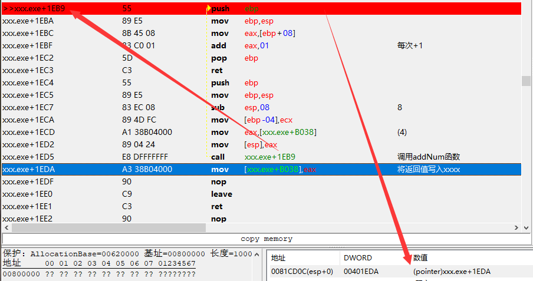
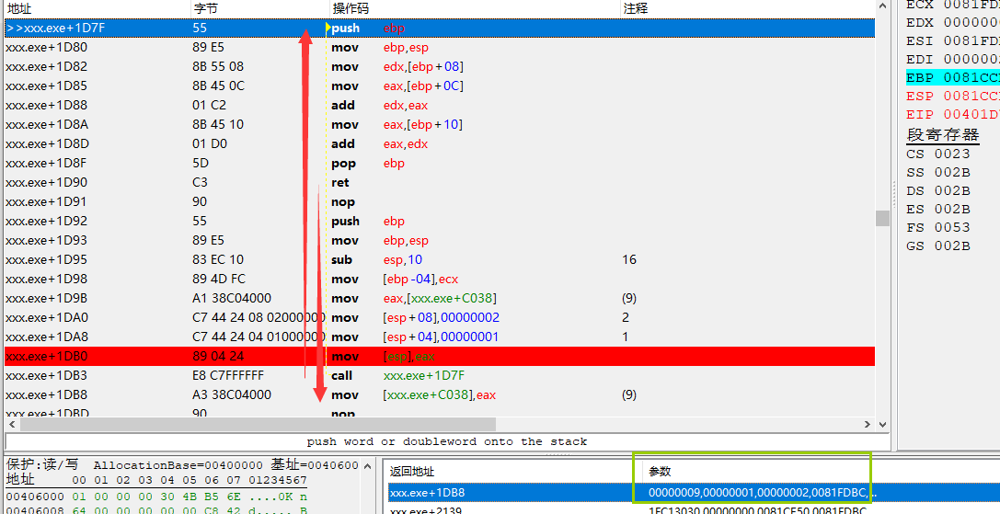
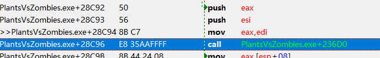
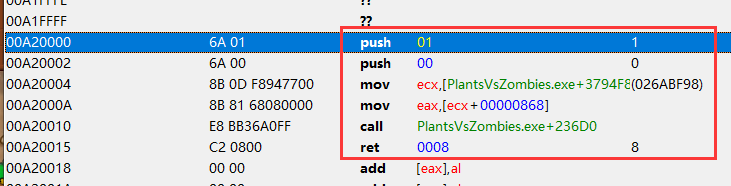
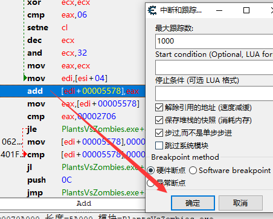
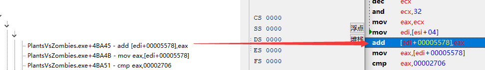

正向代码:
```
int addNum(int x)
{
    return x + 1;
}

int xxxx = 0;
void MainWindow::on_pushButton_5_clicked()
{
    xxxx = addNum(xxxx);
}
```

逆向代码：



使用了call 进入函数，在函数的第一个指令，添加断点，然后运行程序

因为call会将函数的返回地址压入堆栈，可以在右下角的堆栈看到，当前是哪里在调用这个函数，使用`ctrl+g`跳到`xxx.exe+1eda`


## 选中当前函数

在当前指令上右键，选择当前函数，ce会把指令全部高亮


## 查看函数参数

正向:
```
int add(int a, int b, int c) {
    return a + b + c;
}

int aaa = 0;

void MainWindow::on_pushButton_3_clicked()
{
    aaa = add(aaa, 1 ,2);
}
```

逆向：
```
...

xxx.exe+1D7F - 55                    - push ebp  //函数开始
xxx.exe+1D80 - 89 E5                 - mov ebp,esp
xxx.exe+1D82 - 8B 55 08              - mov edx,[ebp+08] // arg1 => [esp]
xxx.exe+1D85 - 8B 45 0C              - mov eax,[ebp+0C] // arg2 => [esp+04]
xxx.exe+1D88 - 01 C2                 - add edx,eax // edx= arg1+arg2
xxx.exe+1D8A - 8B 45 10              - mov eax,[ebp+10] // arg3 => [esp+08]
xxx.exe+1D8D - 01 D0                 - add eax,edx // edx= edx+arg3
xxx.exe+1D8F - 5D                    - pop ebp
xxx.exe+1D90 - C3                    - ret  //函数返回

...


// 复制当前值到eax寄存器中
xxx.exe+1D9B - A1 38C04000           - mov eax,[xxx.exe+C038]

// 传参过程
xxx.exe+1DA0 - C7 44 24 08 02000000  - mov [esp+08],00000002  // 传入第三个参数
xxx.exe+1DA8 - C7 44 24 04 01000000  - mov [esp+04],00000001  // 传入第二个参数
xxx.exe+1DB0 - 89 04 24              - mov [esp],eax //  传入第一个参数

// 调用函数
xxx.exe+1DB3 - E8 C7FFFFFF           - call xxx.exe+1D7F // 堆栈中将压入 xxx.exe+1DB8

// 将返回值写入xxx.exe+C038
xxx.exe+1DB8 - A3 38C04000           - mov [xxx.exe+C038],eax
```

在ce内存查看其中可以看到，一些参数的分析



## ce调用函数

1. 先找到你要调用的函数，和函数需要的参数

 

2. `ctrl+a`编写要写入的函数
```
// 00A20000在接下来的分配内存得到的
00A20000:
 push 1 ; type
 push 0 ; row
 mov ecx,[PlantsVsZombies.exe+3794F8]
 mov eax, [ecx+868]
 call 004236D0
 retn 8
```

3. `ctrl+alt+m`分配内存，将分配内存的地址，写入上面的代码中



4. 在内存查看器中，选中函数的第一行
5. `ctrl+alt+t`创建线程，成功后就会调用此函数，失败游戏可能会崩溃


## 使用CE的，在此中断并跟踪功能

在指令上，右键，在此中断并跟踪功能



在下次执行到这条指令时：



每一层就是一次函数调用，双击会在反汇编窗口跳转