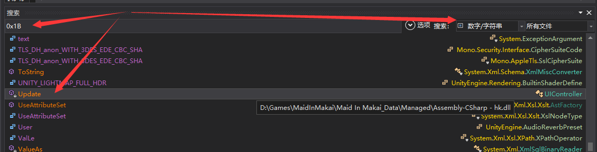

## 找快捷键
- https://www.youtube.com/watch?v=ycu4uCAVv1k

打开Assembly-CSharp.dll后搜索[Virtual-Key](https://docs.microsoft.com/en-us/windows/win32/inputdev/virtual-key-codes)，通常能在Update中找到，快捷方式的事件。

## 退出游戏

通常调用`Application.Quit();`就能退出游戏