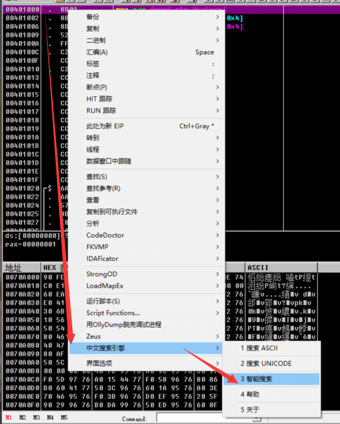
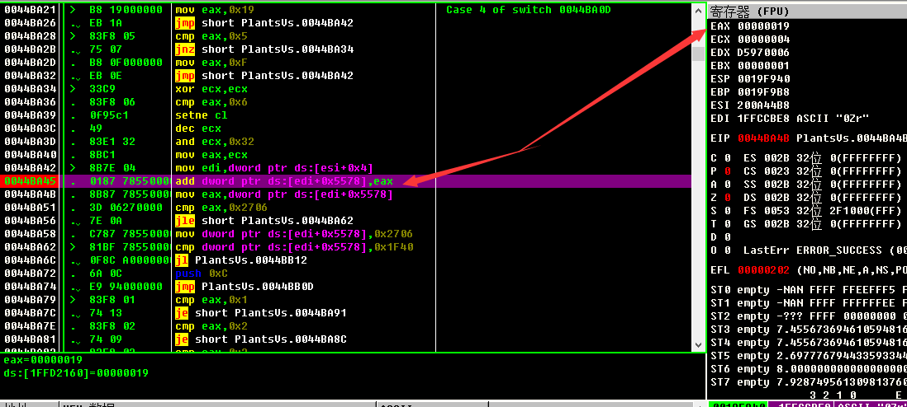
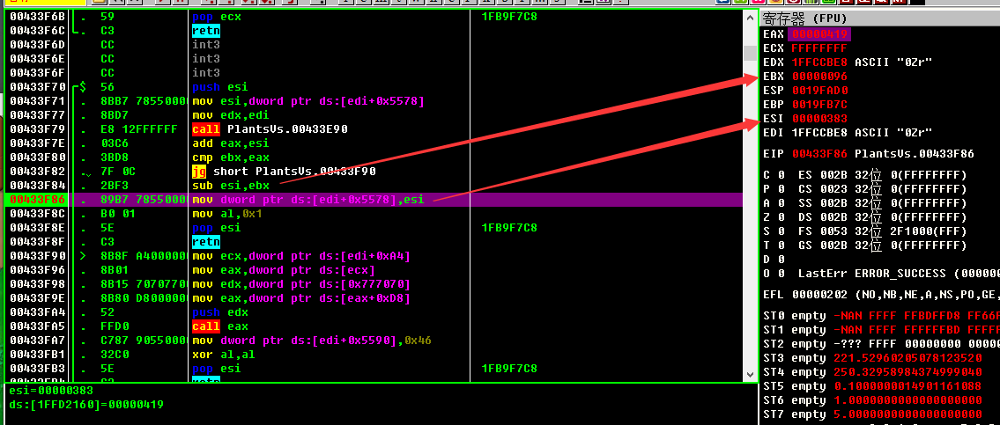
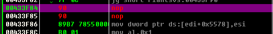
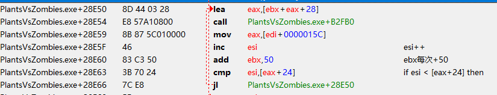
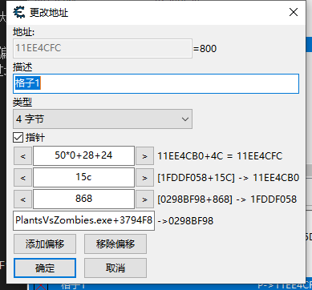
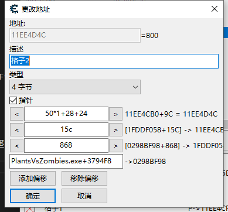

[od下载](https://www.52pojie.cn/thread-350397-1-1.html)

# 切出游戏窗口时，删除暂停事件

> 解决思路，在暂停事件的窗口上，有固定的文本，在程序中找到这个固定的文本


1. 先使用ollydbg打开游戏，然后f9取消调试状态，让游戏运行起来
2. 点击alt+e打开模块窗口
3. 双击游戏的主模块(进程模块)
4. 进入后右键中文查找，没进去的话，多点几次


5. 运行后，会将程序中的中文字符串查询出来
6. 找到相关的文本行，点击进入，按`ctrl+a`分析代码
7. 可以看到一个函数，这个函数基本就是一个事件
8. 可以找到函数头，然后直接ret，反汇编的函数头一般都是:

```
push ebp
mov ebp,esp
```

## 获取阳光和使用阳光

1. 使用ce附加进程，找到阳光值，然后查看是什么访问了该地址，找出使用和添加的代码地址

```
// 添加阳光的代码
0044BA45 - 01 87 78550000  - add [edi+00005578],eax

// 使用阳光的代码
00433F86 - 89 B7 78550000  - mov [edi+00005578],esi
```

2. 先查看添加阳光的反汇编区域，可以使用ce或则od



我使用od打开后，`ztrl+g`找到0044BA45这个地址，然后加断点，当添加阳光后，可以看到右边eax的值是0x19也就是十进制25

我们现在可以强制写入9999，每次执行到这里都会写入固定额数据：

```
add dword ptr ds:[edi+0x5578],0x3E7
```

3. 查找使用阳光值一也是一样的，找到代码后打断点，在执行


 ```
 mov esi,[edi+0x5578]
 ...
 sub esi, ebx
 mov [edi+0x5578], esi
 ```

 上面的图片可以看到 ebx=0x96，计算后的esi=0x383

 转为现代语言，大概就是：
 ```
 esi = [edi+0x5578] // 获取当前总阳光
 esi = esi - ebx    // 总阳光减去消耗阳光
 [edi+0x5578] = esi // 将计算的新值写到内存中去
 ```

 只需将每次消耗的阳光改为0，或者删除这个sub指令，即可：
 


如果在od中要写的写指令大小不够，可以定义一个函数，然后调用

1. ctrl+b 找到一块空地址，然后在空地址中写函数
2. 将要修改的指令jmp到新的函数地址，函数执行完毕jmp回来执行接下来的逻辑，即可
3. 注入脚本还是ce好用点

## 植物的冷却时间

由于每个植物的冷却时间，估计都是调用同一个函数，所以ce注入以下代码后，所有的植物都将无冷却时间:

```
define(address,"PlantsVsZombies.exe"+B2FF0)
define(bytes,3B 47 28 7E 12)

[ENABLE]
assert(address,bytes)
alloc(newmem,$1000)

label(code)
label(return)

newmem:

code:
  // eax <= 冷却max，那么就进入冷却，删除进入冷却逻辑即可
  cmp eax,[edi+28]
  // jle PlantsVsZombies.exe+B3007
  nop
  nop
  jmp return

address:
  jmp newmem
return:

[DISABLE]
address:
  db bytes
  // cmp eax,[edi+28]
  // jle PlantsVsZombies.exe+B3007

dealloc(newmem)
```

## 找格子数组

总之就是一路逆向回去:



```
// 先找到数组中的某项属性，这里找的是冷却

冷却 = [edi+24]
edi = eax
eax =  ebx + [edi+15c] + 28

// ebx = 50, 50 arr[] 说明数组的每项大小只有0x50
// ebx + [edi+15c] 是首地址 [{
// ebx + [edi+15c] + 28 从首地址开始偏移的属性 [{ attr(首地址到这个属性这里偏移28)
// 汇编的循环不是通过改变索引，而是通过地址的偏移，比如第0个ebx=0x50*0,第1个ebx=0x50*1,第2个ebx=0x50*2,

edi = 1FDDF058
扫描 1FDDF058
0298C800 => 1FDDF058
是什么访问了 0298C800 

edi = [esi+00000868] <<
esi = 0298BF98
扫描 0298BF98
PlantsVsZombies.exe+3794F8 => 0298BF98
```

读取格子1:



读取格子2:



想在只需要偏移每个格子的宽度(50)，就能移动下一个格子:
```
[
  // 首地址 >> 11EE4cb0

  (11EE4cb0+0){
    attr1,
    attr2,

    // 11EE4cb0+0+28
    attr3 = {
      attr3_attr1,

      // 11EE4cb0+0+28+24
      attr3_attr2 = 冷却属性存在这里
    } 
  },
 (11EE4cb0+50){
    attr1,
    attr2,

    // 11EE4cb0+50+28
    attr3 = {
      attr3_attr1,

      // 11EE4cb0+50+28+24
      attr3_attr2 = 冷却属性存在这里
    } 
  },
  (11EE4cb0+100){
    attr1,
    attr2,

    // 11EE4cb0+100+28
    attr3 = {
      attr3_attr1,

      // 11EE4cb0+100+28+24
      attr3_attr2 = 冷却属性存在这里
    } 
  }
]
```
